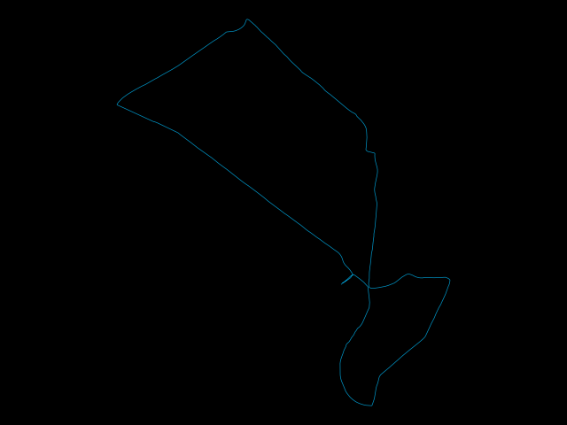

# gpx-lambda
**Fun with GPX files in AWS Lambda/Chalice**

This is an early exploration of using [chalice](https://github.com/aws/chalice) to create
and deploy an API for playing around with GPX files (GPS tracks, e.g. from exported
[Strava](https://www.strava.com/) activities).

## Running locally

Install requirements:
```$sh
pip install -r requirements.txt
```

Run the local chalice server:
```$sh
chalice local
```

## Deploy to AWS Lambda

Install requirements as above, or simply chalice:
```$sh
pip install chalice
```

Deploy to AWS Lambda:
```$sh
chalice deploy
```

See the [chalice quickstart guide](https://chalice.readthedocs.io/en/latest/quickstart.html)
for more information.

## API Routes

### GPX Summary
`/gpx/summary`

Compute global and per-track summaries of tracks in a GPX file. Distance and elevation
metrics are represented as meters.

```
curl -XPOST http://localhost:8000/gpx/summary -d @foo.gpx \
  -H "Content-Type: application/xml"
```

Example response:
```
{
  "total_distance": 14113.27,
  "total_elapsed_seconds": 2467,
  "total_moving_seconds": 2019,
  "total_elevation": 28.3,
  "tracks": [
    {
      "distance": 14113.27,
      "elapsed_seconds": 2467,
      "moving_seconds": 2019,
      "elevation": 28.3
    }
  ]
}
```

### Plot GPX Tracks
`/gpx/plot`

Plot GPX tracks as a static image, returning a PNG file.
```
curl -s -XPOST http://localhost:8000/gpx/plot -d @foo.gpx \
  -H "Content-Type: application/xml" --output foo.png
```

Example response:

